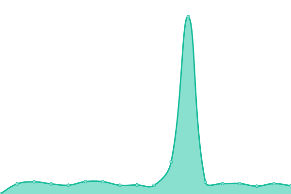
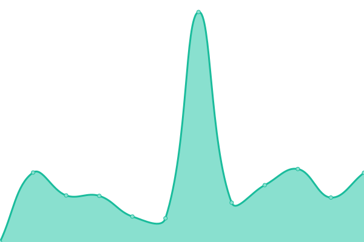

# [📈 Live Status](https://demo.upptime.js.org): <!--live status--> **🟩 All systems operational**

This repository contains the open-source uptime monitor and status page for [Lyuboslav Pashaliyski](https://demo.upptime.js.org), powered by [Upptime](https://github.com/upptime/upptime).

With [Upptime](https://upptime.js.org), you can get your own unlimited and free uptime monitor and status page, powered entirely by a GitHub repository. We use [Issues](https://github.com/lyuboslav2406/status-xrm/issues) as incident reports, [Actions](https://github.com/lyuboslav2406/status-xrm/actions) as uptime monitors, and [Pages](https://demo.upptime.js.org) for the status page.

<!--start: status pages-->
<!-- This summary is generated by Upptime (https://github.com/upptime/upptime) -->
<!-- Do not edit this manually, your changes will be overwritten -->
<!-- prettier-ignore -->
| URL | Status | History | Response Time | Uptime |
| --- | ------ | ------- | ------------- | ------ |
|  [XRM Homepage](https://web.dev.cmxapp.cloud/) | 🟩 Up | [xrm-homepage.yml](https://github.com/lyuboslav2406/status-xrm/commits/HEAD/history/xrm-homepage.yml) | 

 366ms
     
 | 

<a href="https://health.dev.cmxapp.cloud/history/xrm-homepage">45.97%</a>
    

|  [SMS Get Sites](https://sms.dev.cmxapp.cloud/sites) | 🟩 Up | [sms-get-sites.yml](https://github.com/lyuboslav2406/status-xrm/commits/HEAD/history/sms-get-sites.yml) | 

 831ms
     
 | 

<a href="https://health.dev.cmxapp.cloud/history/sms-get-sites">99.54%</a>
    

|  AMS Get Permissions | 🟩 Up | [ams-get-permissions.yml](https://github.com/lyuboslav2406/status-xrm/commits/HEAD/history/ams-get-permissions.yml) | 

 407ms
     
 | 

<a href="https://health.dev.cmxapp.cloud/history/ams-get-permissions">99.54%</a>
    

|  TMS Get Tenants | 🟩 Up | [tms-get-tenants.yml](https://github.com/lyuboslav2406/status-xrm/commits/HEAD/history/tms-get-tenants.yml) | 

 1265ms
     
 | 

<a href="https://health.dev.cmxapp.cloud/history/tms-get-tenants">99.54%</a>
    

|  [SAS Login Unauthorized](https://sas.dev.cmxapp.cloud/auth/awsidentity/) | 🟩 Up | [sas-login-unauthorized.yml](https://github.com/lyuboslav2406/status-xrm/commits/HEAD/history/sas-login-unauthorized.yml) | 

 773ms
     
 | 

<a href="https://health.dev.cmxapp.cloud/history/sas-login-unauthorized">100.00%</a>
    

|  [SC Get Sites](https://sc.dev.cmxapp.cloud/vms/rest/v1/sites) | 🟩 Up | [sc-get-sites.yml](https://github.com/lyuboslav2406/status-xrm/commits/HEAD/history/sc-get-sites.yml) | 

 718ms
     
 | 

<a href="https://health.dev.cmxapp.cloud/history/sc-get-sites">99.54%</a>
    

<!--end: status pages-->

[**Visit our status website →**](https://demo.upptime.js.org)

## 📄 License

- Powered by: [Upptime](https://github.com/upptime/upptime)
- Code: [MIT](./LICENSE) © [Anand Chowdhary](https://anandchowdhary.com), supported by [Pabio](https://pabio.com)
- Data in the `./history` directory: [Open Database License](https://opendatacommons.org/licenses/odbl/1-0/)
